# Godot State Charts Manual

## Introduction

Godot State Charts is a plugin for Godot Engine that allows you to use state charts in your game. Now what is a state chart? [Statecharts.dev](https://statecharts.dev/) explains it like this:

> Put simply, a state chart is a beefed up state machine.  The beefing up solves a lot of the problems that state machines have, especially state explosion that happens as state machines grow.

Godot State Charts allows you to build state charts in the Godot editor.  The library is built in an idiomatic way, so you can use nodes to define states and transitions and use Godot signals to connect your code to the state machine. As states and transitions are nodes you can also easily modularize your state charts by using scenes for re-using states and transitions.

There is only a single class with two methods for your code to interface with the state chart. This makes it easy to integrate state charts into your game, as you don't need to extend from a base class or implement an interface for your states.

## Installation

The easiest way to install the plugin is to use the Godot Asset Library. Search for "Godot State Charts" and install the plugin. You can exclude the `godot_state_charts_examples` folder if you don't need the examples. 

You can also download a ZIP file of this repository and extract it, then copy the `addons/godot_state_charts` folder into your project's `addons` folder.

After you installed it, make sure you enable the plugin in the project settings:


## Usage

The plugin adds a new node type called _State Chart_. This node represents your state chart and is the only node that your code will directly interact with. 

Below this node you can add the root state of your state chart, this will usually be a _Compound State_ or a _Parallel State_. You can add as many states as you want to your state chart, but you can only have one root state. Below each state you can add _Transition_ nodes. These nodes define the transitions between states. You can add as many transitions as you want to any state. 

You can add nodes through the usual _Add node_ dialog in Godot. Just type "state" or "transition" into the search field and you will see the nodes in the list.


Starting with version 0.2.0 there is also an improved UI to quickly add nodes and transitions with a single click. The UI is displayed automatically when you select a state chart node to which nodes can be added:

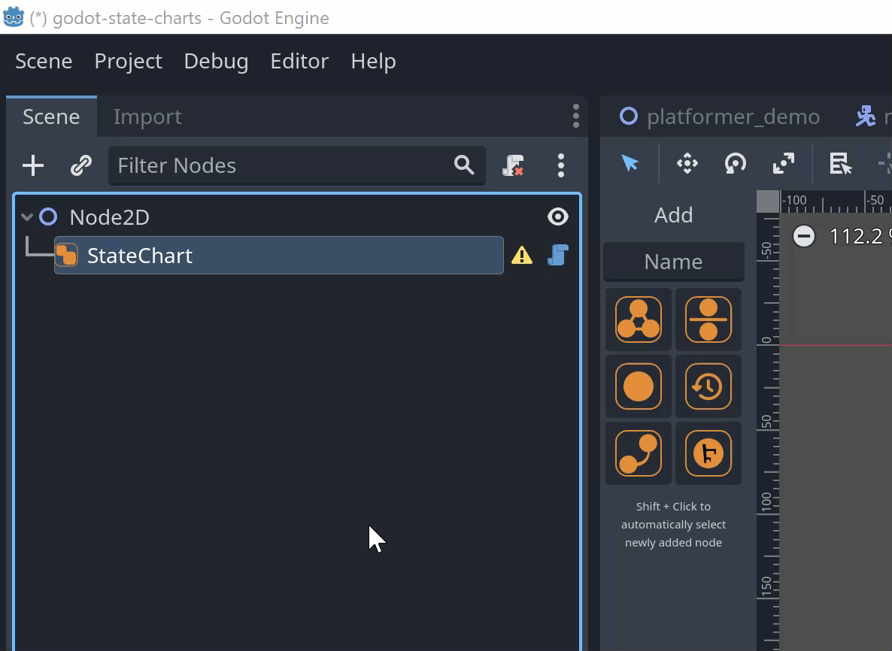

If you hold down `Shift` while clicking the button for the node you want to add, the newly added node will be selected automatically. Otherwise the node will be added to the currently selected node but the currently selected node will stay selected.

The new UI supports undo/redo, so you can undo the addition of a node or transition with `Ctrl+Z`.

### Examples

The plugin comes with a few examples. You can find them in the `godot_state_charts_examples` folder. To run an example, open and run it's main scene. The examples are:

- `platformer` - a simple platformer game with a state chart for the player character that handles movement, jumping, falling, double jumps, coyote jumps and animation control. This example shows how state charts can massively simplify the code needed to implement a full player character controller. The character controller code is less than 70 lines of code.
- `ant_hill` - a rudimentary ant hill simulation. The ants are controlled by a state chart that handles the different states of the ants such as searching for food, carrying food, returning to the nest, etc. This example shows how state charts can simplify a lot of the if-else logic that is often needed to implement AI.
- `history_states` - an example that shows how you can use history states to implement a state machine that can remember the last active state of a compound state. 
- `performance_test` - this example is a small test harness to evaluate how larger amounts of state charts will perform. It contains a state chart in `state_chart.tscn` which you can adapt to match your desired scenario. The actual performance will depend on what callback signals you will use so you should adapt the state chart in `state_chart.tscn` to match your scenario. Then there are scenes named `ten_state_charts.tscn`, `hundred_state_charts.tscn` and `thousand_state_charts.tscn` which each contain 10, 100 or 1000 instances of the state chart from `state_chart.tscn`. You can run these scenes to see how many instances of the state chart  you can run on your machine. Use the profiler to see how much time is spent in the state chart code. 
- `order_of_events` - an example state chart to explore in which order events are fired. See also the [appendix](#order-of-events) for more information.

### The _State Chart_ node

 The _State Chart_ node is your main way of interacting with the state charts. It allows you to send events to the state chart using the `send_event(event)` method. You can also set expression properties with the `set_expression_property(name, value)`  function, which can later be used by expression guards to determine whether a certain transition should be taken (see the section on expression guards for more information).


### States

States are the building blocks from which you build your state charts. A state can be either active or inactive.  On start the root state of the state chart will be activated. When a state has child states, one or more of these child states will be activated as well. States provide a range of signals which you can use to react to state changes or to execute code while the state is active. The following signals are available:

- `state_entered()` - this signal is emitted when the state is entered.
- `state_exited()` - this signal is emitted when the state is exited.
- `event_received(event)` - this signal is emitted when an event is received by the state while the state is active. The event is passed as a parameter.
- `state_processing(delta)` - this signal is emitted every frame while the state is active. The delta time is passed as a parameter. The signal will obey pause mode of the tree, so if the node is paused, this signal will not be emitted.
- `state_physics_processing(delta)` - this signal is emitted every physics frame while the state is active. The delta time is passed as a parameter. The signal will obey pause mode of the tree, so if the node is paused, this signal will not be emitted.
- `state_input(input_event)` - called when input is received while the state is active. This is useful to limit input to certain states.
- `state_unhandled_input(input_event)` - called when unhandled input is received while the state is active. Again this is useful to limit input to certain states.

#### Atomic states

 Atomic states are the most basic type of state. They cannot have child states. Atomic states have no additional properties.

#### Compound states

 Compound states are states which have at least one child state (though having at least two child states makes more sense). Only one child state of a compound state can be active at any given time. Compound states have the following properties:

- _Initial state_ - this property determines which child state will be activated when the compound state is entered directly. You can always activate a child state by explicitly transitioning to it. If you do not set an initial state then no child state will be activated and an error will be printed to the console.


#### Parallel states

 Parallel states are similar to compound states in that they can have multiple child states. However, all child states of a parallel state are active at the same time when the parallel state is active. They allow you to model multiple states which are independent of each other. As such they are a great tool for avoiding combinatorial state explosion that you can get with simple state machines. Parallel states have no additional properties.

#### History states

 History states are pseudo-states. They are not really a state but rather activate the last active state when being transitioned to. They can only be used as child states of compound states. They are useful when you temporarily want to leave a compound state and then return to the state you were in before you left. History states have the following properties:

- _Deep_ - if true the history state will capture and restore the state of the whole sub-tree below the compound state. If false the history state will only capture and restore the last active state of its immediate parent compound state.
- _Default state_ - this is the state which will be activated if the history state is entered and no history has been captured yet. If you do not set a default state, the history state will not activate any state when it is entered and an error will be printed to the console.


To use a history state, set up a transition that transitions directly to the history state. This will restore the last known state or activate the default state if no history has been captured yet. If your compound state has a history state as a child but you do not want to restore the history when entering the compound state, you can transition to the compound state directly. This will activate the initial state of the compound state and will not restore the history. Also check the history state example in the examples folder.

#### Animation tree states

_Note: this feature is currently experimental and may change or be replaced in the future._

 Animation tree states are a variation of atomic states. They can be linked to an animation tree. When an animation tree state is activated it will ask the animation tree to travel to the same state (the animation tree state and the state inside the animation tree should have the same name). This can be used to control animation trees with the same state chart events that you use to control your game logic. Animation tree states have the following properties:

- _Animation tree_ - the animation tree that should be controlled by the animation tree state.
- _State Name_ - the name of the state inside the animation tree that should be activated when the animation tree state is activated. This is optional, if you do not set a state name, the animation tree state will activate the state with the same name as the animation tree state.


Animation tree states are usually independent of the rest of the states, so it is usually a good idea to use a parallel state to separate them from the rest of the states.

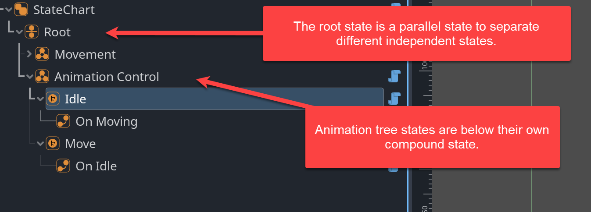


#### Animation player states

_Note: this feature is currently experimental and may change or be replaced in the future._

 Animation player states are similar to animation tree states. They can be linked to an animation player. When an animation player state is activated it will ask the animation player to play the same animation (the animation player state and the animation inside the animation player should have the same name). This can be used to control animation players with the same state chart events that you use to control your game logic. Animation player states have the following properties:

- _Animation player_ - the animation player that should be controlled by the animation player state.
- _Animation Name_ - the name of the animation inside the animation player that should be played when the animation player state is activated. This is optional, if you do not set an animation name, the animation player state will play the animation with the same name as the animation player state.
- _Custom Blend_ - a custom animation blend time. The default is `-1` which will use the animation player's default blend time.
- _Custom Speed_ - a custom animation speed. The default is `1.0` which will play the animation forwards with normal speed. You can use negative values to play the animation backwards or values greater than `1.0` to play the animation faster.
- _From End_ - if true the animation will be played from the end to the beginning. This is useful if you want to play an animation backwards. Note that you will still need to set the custom speed to a negative value to actually play the animation backwards.


Similar to animation tree states, animation player states are usually independent of the rest of the states, so it is usually a good idea to use a parallel state to separate them from the rest of the states.

### Events and transitions

 Transitions allow you to switch between states. Rather than directly switching the state chart to a certain state, you send events to the state chart. These events then trigger one or more transitions.  You can send events to the state chart by calling the `send_event(event)` method. For example, if we have a compound state with two child states _Idle_ and _Walking_ and we have set up two transitions, one reacting to the event `move` and one reacting to the event `stop`. The _Idle_ state is the initial state.

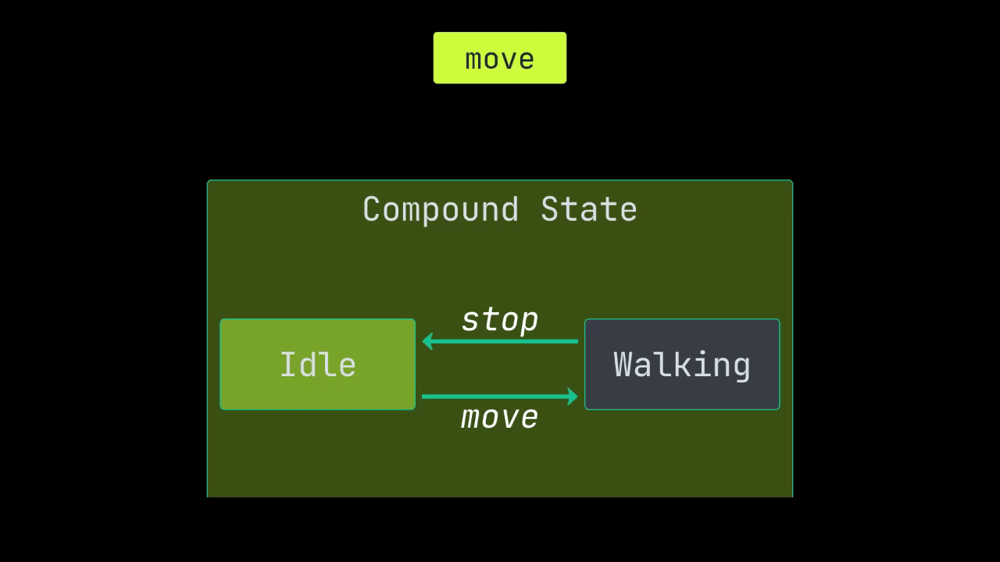

Now we start by sending the `move` event to the state chart. The compound state will forward the event to the currently active state, which is the _Idle_ state. On the _Idle_ state a transition reacting to the `move` event is defined, so this transition will execute and the state chart will switch to the  _Walking_ state. 

Now we send a `stop` event to the state chart. The currently active state is now _Walking_ so the the compound state will forward the event to the _Walking_ state. On the _Walking_ state a transition reacting to the `stop` event is defined, so that transition will execute and the state chart will switch back to the _Idle_ state.

In deeper state charts, events will be passed to the active states going all the way down until an active leaf state (a state which has no more child states) is reached. Now all transitions of that state will be checked, whether they react to that event. If a transition reacts to that event it will be queued for execution and the event is considered as handled. If no transition handles a given event, the event will bubble up to the parent state until it is consumed or reaches the root state. If the event reaches the root state and is not consumed, it will be ignored.

#### Transitions on entering a state

It is possible to immediately transition elsewhere when a state is entered. This is useful for modeling [condition states](https://statecharts.dev/glossary/condition-state.html). To make a transition execute immediately when a state is entered, leave the _Event_ field empty. Usually you will put a guard on such a transition to make sure it is only taken when a certain condition is met.


#### Delayed transitions

Transitions can execute immediately or after a certain time has elapsed. If a transition has no time delay it will be executed immediately (within the same frame). If a transition has a time delay, it will be executed after the time delay has elapsed but only if the state to which the transition belongs is still active and was not left temporarily. Once a state is left, all transitions which were queued for execution will be discarded. There is one exception to this rule, when you are using history states. When you leave a state and re-enter it through a history state, then any pending transition will be resumed as if you had never left the state.

#### Transition guards

A transition can have a guard which determines whether the transition should be taken or not. If a transition reacts to an event the transition's guard will be evaluated. If the guard evaluates to `true` the transition will be taken. Otherwise the next transition which reacts to the event will be checked. If a transition has no guard, it will always be taken. Guards can be nested to create more complex guards. The following guards are available:

-  _AllOfGuard_ - this guard evaluates to `true` if all of its child guards evaluate to `true` (logical AND).
-  _AnyOfGuard_ - this guard evaluates to `true` if any of its child guards evaluate to `true` (logical OR).
-  _NotGuard_ - this guard evaluates to the opposite of its child guard.
-  _StateIsActiveGuard_ - this guard allows you to configure and monitor a state. The guard evaluates to `true` if the state is active and to `false` if the state is inactive.
-  _ExpressionGuard_ - this guard allows you to use expressions to determine whether the transition should be taken or not. 

##### Expression guards
Expression guards give you the most flexibility when it comes to guards. You can use expressions to determine whether a transition should be taken or not. Expression guards are evaluated using the [Godot Expression](https://docs.godotengine.org/en/stable/classes/class_expression.html) class. You can add so-called _expression properties_ to the state chart node by calling the `set_expression_property(name, value)` method. 

```gdscript
@onready var state_chart: StateChart = $StateChart

func _ready():
    # Set an expression property called "player_health" with the value 100
    state_chart.set_expression_property("player_health", 100)
```
These properties can then be used in your expressions. The following example shows how to use expression guards to check whether the player's health is below 50%:


### Debugging

 When the game is running it is very useful to see the current state of the state chart for debugging purposes. For this, this library contains a state chart debugger that you can add to your scene. You can add it to your scene by pressing the "Instantiate child scene" icon above the node tree and then looking for "debugger":


 The debugger is a control node that you can position anywhere in your scene where it makes sense (maybe you already have an in-game debugging screen where you can add it). Since it is a control it can easily be integrated into an existing UI.

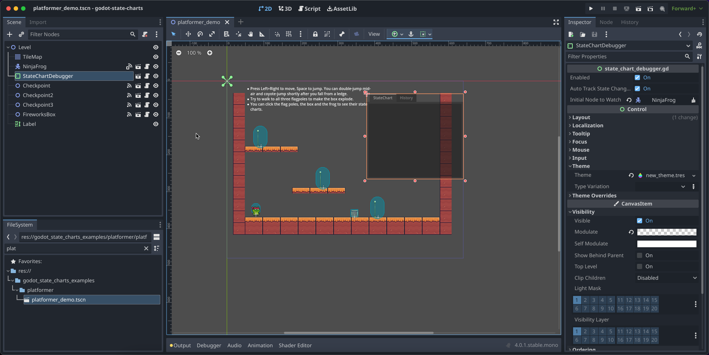

The state chart debugger is has a property _Initial node to watch_ where you can set a node that should be watched. It doesn't necessarily need to be a state chart node, the debugger will search for a state chart anywhere below the node you set. This is useful when you have the state chart nested in a sub-scene and you want to watch the state chart from the root scene where you don't have access to the state chart node.

You can also use the `debug_node` function of the state chart debugger to change the node that is being watched at runtime. For example you could add code that changes the debugged node when clicking on a unit or object in your game

```gdscript
@onready var debugger: StateChartDebugger = $StateChartDebugger

func _on_unit_clicked(unit):
    debugger.debug_node(unit)
```

Another option is to directly use built-in signals and set the node to debug in the editor UI. This is how it was done in the example projects:

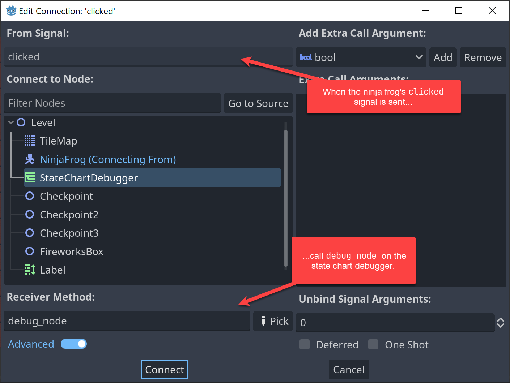

At runtime, the state chart debugger will show the current state of the state chart, including all currently set expression properties. It also indicates time left for delayed transitions, so you have a good overview of what is going on in your state chart.


By default, the state chart debugger will track state changes in the state chart it watches and print them into the "History" tab. This way you can see which state transitioned into which state and when. 


You can add custom lines into the history by calling the `add_history_entry` function. This is useful if you want to have additional information in the history. 

```gdscript
debugger.add_history_entry("Player died")
```

The debugger will only track state changes of the currently watched state chart. If you connect the debugger to a different state chart, it will start tracking the state changes of the new state chart.

If you want to disable the history tracking, you can unset the _Auto Track State Changes_ checkbox in the editor UI.

## Tips & tricks

### Keep state and logic separate

State charts work best when you keep the state and the logic separate. This means that the state charts should contain all the rules for changing states while your code should only contain the logic that is executed when when being in a state or when entering or leaving a state. You should not track the current state in your code, that is the responsibility of the state chart. The `StateChart` class deliberately does not expose the current state of the state chart for this reason.

Instead, use the provided state events to trigger logic in your code. Many times you don't even need to write any code. For example if you have a bomb that explodes and you want to play a sound when it enters the _Exploding_ state, you can simply link up the `state_entered` signal of the _Exploding_ state to the `play` function of your audio player.

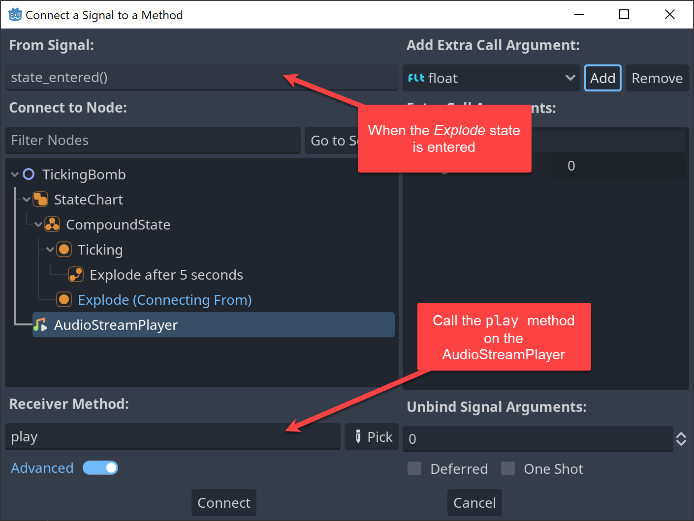

If you only want to allow input in certain states, connect the `state_processing` or `state_physics_processing` signals to the same method of your code for all the states where the input is allowed. You can see one example of this in the platformer example, where jumping is only allowed in certain states:

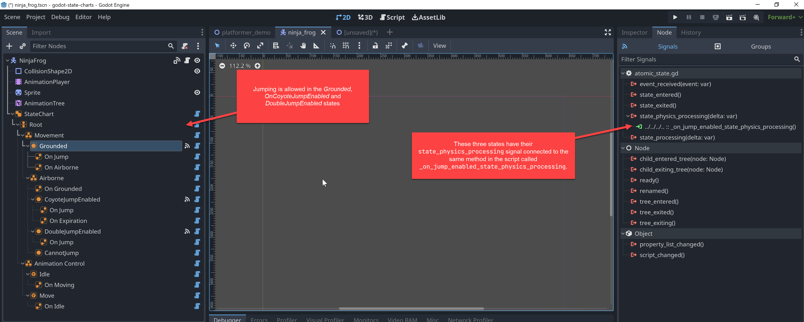

The way this is set up the code doesn't need to know which states may exist or when you are allowed to jump. The state chart takes care of that and the jumping code is only executed when the state chart is in a state where jumping is allowed.

```gdscript
## Called in states that allow jumping, we process jumps only in these.
func _on_jump_enabled_state_physics_processing(_delta):
	if Input.is_action_just_pressed("ui_accept"):
		velocity.y = JUMP_VELOCITY
		_state_chart.send_event("jump")
```

### Remember that events bubble up in the chart tree

When you have multiple states that need to react on the same event, you can handle the event in the parent state. For example in the platformer demo, the frog can be in multiple different states while it is airborne.

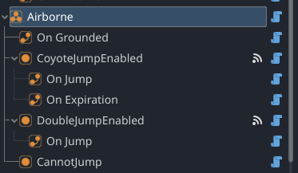

However no matter in which specific airborne state the frog is, once it lands on the ground it always should transition back to the _Grounded_ state. Therefore the transition for handling this has been added to the _Airborne_ state. This way the transition will be taken no matter in which specific airborne state the frog is. Since no sub-state of _Airborne_  (_CoyoteJumpEnabled_, _DoubleJumpEnabled_, _CannotJump_) handles the event, the event will bubble up to the parent state _Airborne_ and the transition will be taken.

### Give everything meaningful names

Because both states and transitions are nodes, it is very easy to rename them in the editor. Use this to provide meaningful names for your states and transitions. This makes it easier to understand what is going on in your state chart and also makes it easier to find the right node in the editor. Transitions should have the event they react on in their name, for example _On Jump_ or _On Attack_.  State names should be descriptive, for example _Grounded_, _Airborne_, _CoyoteJumpEnabled_, _DoubleJumpEnabled_, _CannotJump_. Since you will never type a state name or transition name directly in your code, you can use longer names that are easy to understand.

### Use the built-in "Editor Description" feature

Godot has a very nice built-in comment field named "Editor Description". Use this to write down some thoughts about why a state or transition exists and how it works in conjunction with other states and transitions. This is especially useful when you have a complex state chart with many states and transitions. Just like you write comments for your code, it is a good idea to write comments for your state charts.

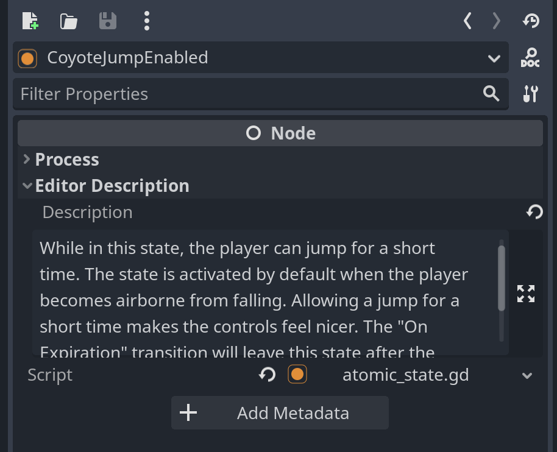


## Appendix

### Order of events

Usually you don't need to worry too much about the order in which state changes are processed but there are some instances where it is important to know the order in which events are processed. The following will give you an overview on the inner workings and the order in which events are processed.

For this example we will use the following state chart:

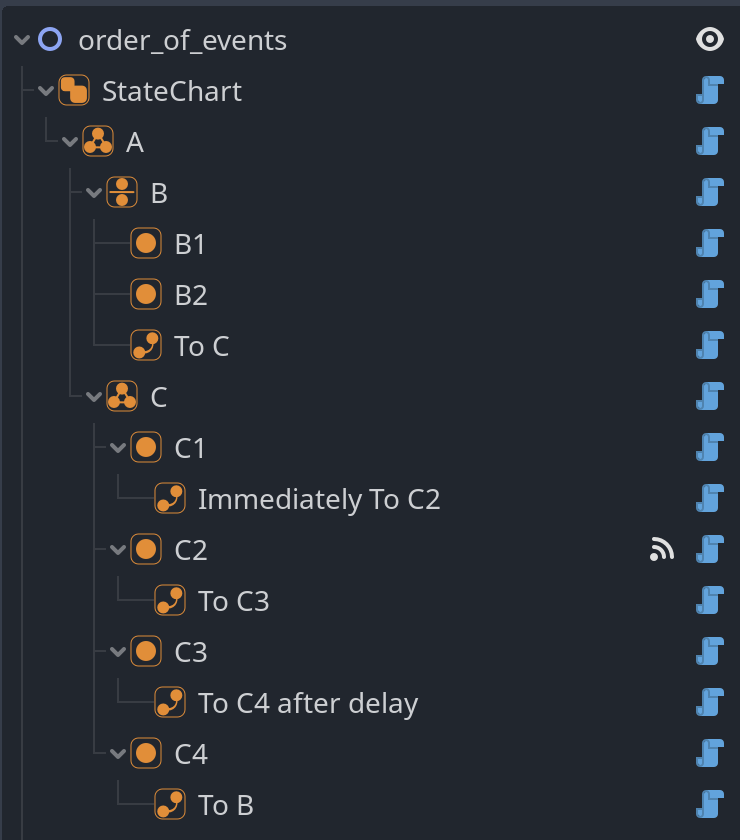. When the program starts, state _B_ is active. Since it is a parallel state, it will automatically activate its child states, _B1_ and _B2_. This is the starting position.


Now we send an event to the state chart that will trigger a transition to state _C_. Now the following things will happen:

- Since we leave _B_, the child states _B1_ and _B2_ will exited. They are exited in the order in which they are defined, so first _B1_ and then _B2_. This will also emit the `state_exited` signal on each of the child states.
- Then _B_ will exit and emit the `state_exited` signal.
- Now we enter _C_ which is a compound state. First the `state_entered` signal will be emitted on _C_. Now _C_ will look for its initial state which is _C1_ and will activate it. This will emit the `state_entered` signal on _C1_.
- We can see that _C1_ has a transition named _Immediately to C2_ which will immediately transition the active state from _C1_ to _C2_. This will emit the `state_exited` signal on _C1_ and the `state_entered` signal on _C2_.
- On _C2_ we have another little contraption, a receiver on _C2_'s `state_entered` signal. This will send an event to the state chart which triggers the _To C3_ transition. So we will immediately transition from _C2_ to _C3_. This will emit the `state_exited` signal on _C2_ and the `state_entered` signal on _C3_.
- Until here, everything happens within the same frame. On _C3_ we have a delayed transition to _C4_ which is executed 0.5 seconds later.  This will emit the `state_exited` signal on _C3_ and the `state_entered` signal on _C4_.

Then we have reached this state:

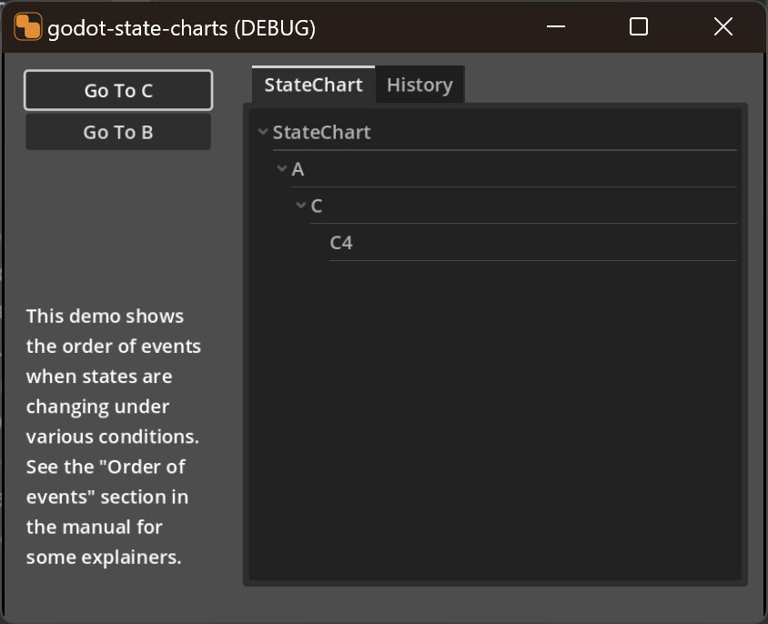

Now we can switch back to state _B_ by sending the appropriate event to the state chart. This will trigger the following events:

- Since we leave _C_, the currently active state _C4_ will be exited and the `state_exited` signal will be emitted for this state. Then _C_ will be exited and the `state_exited` signal will be emitted for this state.
- We now enter _B_ again, and fire the `state_entered` signal on _B_. Since _B_ is a parallel state, it will activate its child states _B1_ and _B2_ again. This will emit the `state_entered` signal on _B1_ and _B2_.


You can also see this in action in the `order_of_events` example in the `godot_state_charts_examples` folder. The _History_ tab of the state chart debugger will show you the order in which the events are processed.


You can also modify this example and explore the order of events yourself.